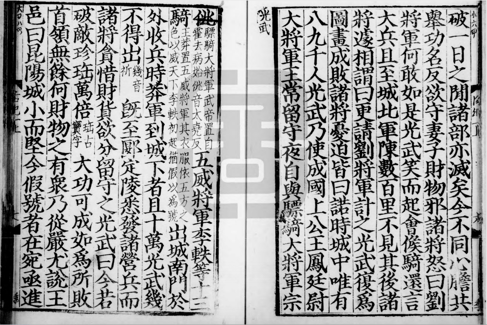
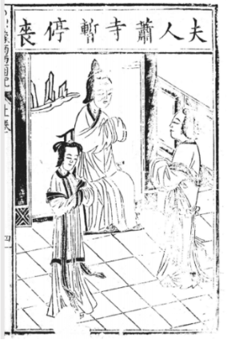
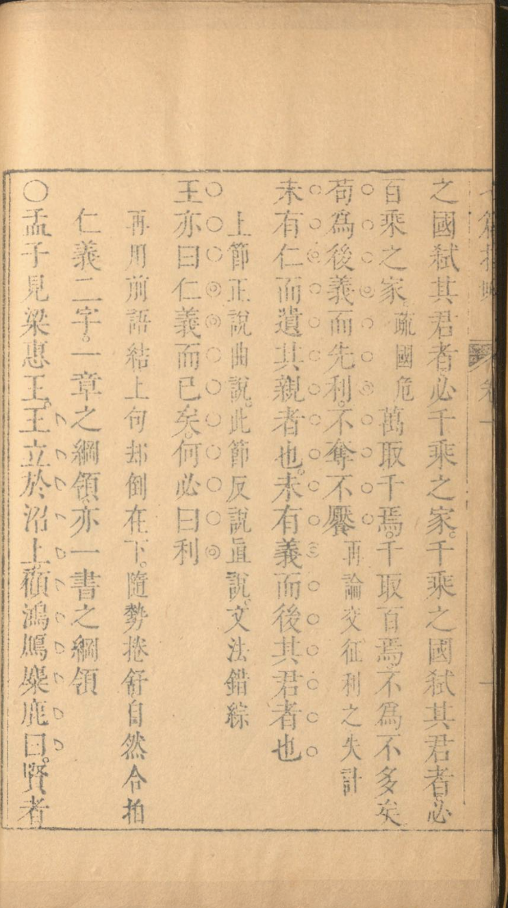
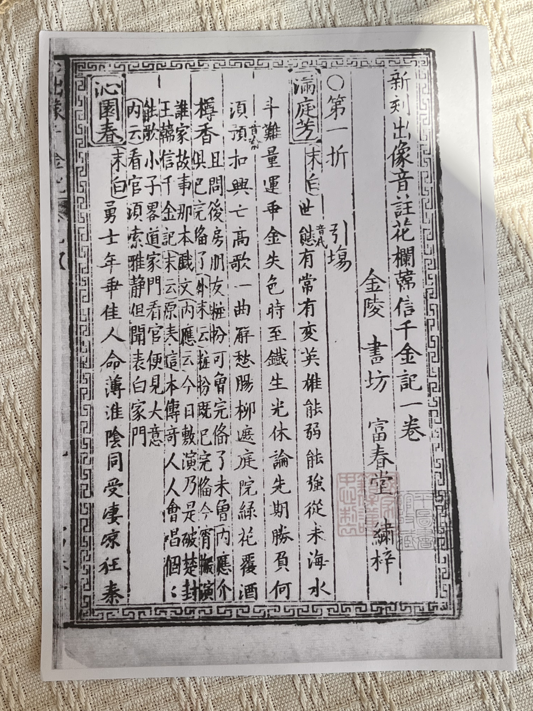

# SongPanda-PaddleOCR

<p align="center">
  
  
</p>

<p align="center"><em>面向中文古籍刻本理解的视觉语言模型</em></p>
<p align="center"><em>把古籍 OCR 从「纯文本转录」推进到「文档字段解构」</em></p>

<p align="center">
  <a href="https://zhengningch.github.io/SongPanda-PaddleOCR/">🌐 项目主页</a> ·
  <a href="https://aistudio.baidu.com/datasetdetail/guji/songpanda-bench">📦 评测数据集</a> ·
  <a href="https://huggingface.co/ningzhuo/SongPanda2.3">🤗 模型权重</a> ·
  <a href="https://www.modelscope.cn/studios/zhuoning/paddleocr-vl-cpu-demo">🎬 在线 Demo</a>
</p>

---

## 📖 背景

古籍（特别是带夹注、眉批、圈点的东亚汉籍）在公开 OCR 基准中**极度稀缺**。现有开源（PaddleOCR-VL 系列）与闭源（识典古籍、古籍酷）模型**均不具备字段区分能力**——会把版心误识为正文、无法还原双行小字夹注阅读顺序。SongPanda 正是切入这一空白。

> 第十届百度搜索创新大赛 · PaddleOCR 全球衍生模型挑战赛参赛作品

## 🎯 任务

SongPanda 将古籍 OCR 定义为**多任务联合的文档字段解构**，而非单纯文本转录：

| 子任务 | 标签 | 说明 |
|---|---|---|
| 版心去除 + 正文转录 | 纯正文 | 自动删去版心字段 |
| 双行小字夹注还原 | `【…】` | 含阅读顺序还原 |
| 眉批提取 | `<…>` | 页眉评论 |
| 圈点符号识别 | `● ○ 、 ◎` | 句读 / 标点标记 |

## 📊 评测集 SongPanda-Bench

按三期递进构建 + 实拍补充，共 **739 张**真实古籍影像：

| 期次 | 子集 | 规模 | 核心特征 |
|---|---|---|---|
| 一期 | SongPanda-Bench | 356 张 | 正文 + 双行小字夹注 + 去版心 |
| 二期 | 复杂版面 | 71 张 | 图文并排 / 表格 / 版画 / 扉页 |
| 三期 | 圈点批注 | 120 张 | 圈点 / 旁批 / 眉批 / 夹批 |
| 实拍 | 光照 + 折痕 | 192 张 | 真实拍摄干扰（光照异常 / 折痕畸变）|

数据集已发布至 AI Studio 开放数据集：`guji/songpanda-bench`

### 评测集样例

<table>
  <tr>
    <td align="center"><br/><sub>一期 · 正文 + 双行夹注</sub></td>
    <td align="center"><br/><sub>二期 · 复杂版面（图文并排）</sub></td>
  </tr>
  <tr>
    <td align="center"><br/><sub>三期 · 圈点批注</sub></td>
    <td align="center"><br/><sub>实拍 · 光照干扰</sub></td>
  </tr>
</table>

## 📁 仓库结构

```
github/
├── src/                    # 评测脚本与训练代码（eval.py / grpo_reward.py 等）
├── train-pipeline-demo/    # 合成训练数据 pipeline demo（代码 + 字体 + 配置）
├── eval-annotation-demo/   # 标注前端 demo（眉批 & 圈点 OCR 校勘，代码 + 截图）
├── assets/                 # README 用图（logo / 样例 / 网页截图）
└── index.html              # GitHub Pages 入口
```

## 🌐 网页预览

<p align="center">
  
</p>

在线体验：https://zhengningch.github.io/SongPanda-PaddleOCR/

## 🛠️ 开源工具（代码全部开源）

本项目不仅开源模型与数据集，还开源了两套自研工具的完整代码，降低古籍 VLM 训练与标注门槛：

| 工具 | 目录 | 说明 |
|---|---|---|
| **眉批 & 圈点 OCR 校勘标注前端** | [`eval-annotation-demo/`](eval-annotation-demo/) | 自研标注网站：双级质检预警（L1 OCR 置信度 / L2 BERT 疑似错字）、逐字圈点插入、按页确认、撤销、导出 Excel/JSON，构成可审计的标注流程 |
| **合成训练数据 pipeline** | [`train-pipeline-demo/`](train-pipeline-demo/) | 基于 [vRain](https://github.com/shanleiguang/vRain) 的古籍刻本合成流水线，从版式标注到批量合成一键完成，支持夹注 / 眉批 / 圈点 / 多栏 / 图文版式 |

> 两套工具均可直接 `git clone` 后本地运行。标注前端让非工程师也能高质量完成古籍字段级标注；合成 pipeline 让后续研究者可自行扩展版式与噪声生成训练数据。

## 🔧 方法

- **基座**：PaddleOCR-VL-1.6（~1B 参数，OCR 专精视觉编码器）
- **训练数据**：合成数据（基于 [vRain](https://github.com/shanleiguang/vRain)）+ 真实数据（四库全书图文匹配 + 哈佛藏善本）
- **策略**：课程学习分阶段 SFT（夹注 → 眉批/圈点 → 复杂版式 → 汇总）+ GRPO 强化学习
- **GRPO 创新**：无 GT 场景下用 SikuBERT 错误检测模型构造连续奖励函数，含 length bonus 门控与 bert-rep 耦合，防 reward hack

## 🏆 关键结果

| 模型 | 一期精度 | 三期严格精度 |
|---|---|---|
| PaddleOCR-VL-1.6（基座）| 79.50 | 60.77 |
| Kimi-K2.6（~1T）| 81.86 | 65.97 |
| **SongPanda 2.3（四期 SFT）** | **83.95** | 68.46 |
| **SongPanda 2.3（五期 GRPO）** | 82.72 | **71.74** |

> PaddleOCR-VL-1.6 参数量仅约 Qwen2.5-VL-7B 的 1/7，微调后超越多个更大规模模型——「OCR 是母语，古籍只是换方言」。

## 🔗 资源链接

| 资源 | 地址 |
|---|---|
| 项目主页 | https://zhengningch.github.io/SongPanda-PaddleOCR/ |
| 评测数据集 | https://aistudio.baidu.com/datasetdetail/guji/songpanda-bench |
| 模型权重 | https://huggingface.co/ningzhuo/SongPanda2.3 |
| 在线 Demo | https://www.modelscope.cn/studios/zhuoning/paddleocr-vl-cpu-demo |

## 🙏 致谢

- 感谢"全球汉籍影像开放集成系统"提供真实古籍书影
- 感谢 [vRain](https://github.com/shanleiguang/vRain)、[daizhige](https://github.com/up2hub/daizhige) 等开源项目
- 标注团队：段伟（上海师大）、阳思彤（华东师大）、沈晨（武汉大学）；总仲裁：郑陈锐（中山大学）

## 📜 引用

```bibtex
@misc{songpanda2025,
  title  = {SongPanda: A VLM for Chinese Classical Book OCR with Field Discrimination},
  author = {SongPanda Team},
  year   = {2025},
  url    = {https://zhengningch.github.io/SongPanda-PaddleOCR/}
}
```

许可证：Apache-2.0
