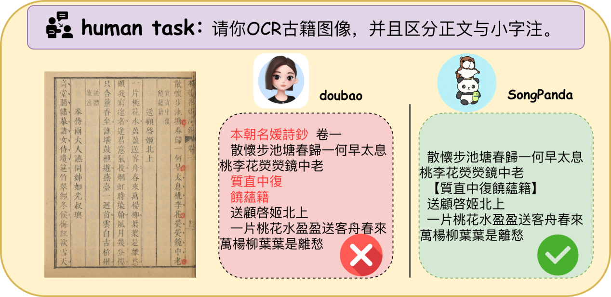

# SongPanda2.0

**作者**：[zhengningch](https://github.com/zhengningch)

**许可证**：Apache-2.0

---

## 背景&摘要

对古籍图像的理解应该视作文档理解任务。如今 OCR 模型在转录古籍图像时，会丢失了许多本应该获取到的视觉信息。业界利用多模态大语言模型，则实现了对复杂分局文档的信息获取。然而，聚焦于古籍垂直领域，知识门槛高、图像标注成本高，成为了模型真正理解古籍的最大障碍。

基于此，本项目提出了一种合成古籍图像数据的方法，提供了一个 20000 余张古籍图像的训练集，这大大降低了古籍垂直领域数据标注的成本。不仅如此，本项目还结合古籍版本学知识，精心构建了一个覆盖宋代以来重要刻本、兼顾域外刻本，共来源 100 余本古籍、356 张图像的测试集，并且设计了适用于复杂版面古籍文档识别的评测方法，命名为 **SongPanda-Bench**。实验利用了小规模的对比实验，证明合成数据拥有与真实数据相近似的效能。最后，基于合成数据，本研究用 paddleocr 微调得到的 **SongPanda2.0**。

利用 SongPanda 模型，可以以较低的成本，高效获得复杂版式古籍的信息，支持人文学者重新回归到实物文献，对如"笺注"之类的副文本展开更宏观、更精细、更立体的研究。

> 上图：面对一张带版心、双行小字夹注的清刻本书影，通用视觉大模型（如 doubao）会把版心的卷次信息误识为正文，而 **SongPanda** 能准确去除版心、识别正文、并以 `<footnote>` 标签还原双行小字夹注的阅读顺序。

---

## 研究范围与任务定义

当用户要求对一张古籍图像进行 OCR 时，模型的期望输出是：

- 自动**删去古籍版心**中无关正文的字段；
- 识别**正文**内容；
- 将**双行小字夹注**以指定格式与正文大字区分开来输出。

**标签体系**：

| 标签 | 含义 |
|------|------|
| `<footnote>...</footnote>` | 双行小字夹注 |
| `<head>...</head>` | 眉批（仅 Mix 训练策略中引入） |
| `\n` | 列末换列（仅 Mix 训练策略中引入） |
| `\f` | 换半页（仅 Mix 训练策略中引入） |
| `#` | 漫漶不清的占位符（Benchmark 标注规范） |

---

## 实验结果

### 表 ：SongPanda-Bench 评测结果

| 模型类型 | 模型名称 | NED_score | NER_F1 | A | 鲁棒性 |
|---|---|---|---|---|---|
| 非通用视觉大模型 | 识典古籍 | 0.79 | - | - | - |
|  | PaddleOCR | 0.80 | - | - | - |
|  | PaddleOCR-VL | 0.68 | - | - | - |
| 通用视觉大模型（闭源） | doubao-1-5-vision-pro | 0.75 | 0.31 | 0.66 | 1 |
|  | Gemini-2.5-pro | 0.77 | 0.43 | 0.71 | 0.99 |
|  | ChatGPT-5 | 0.75 | 0.38 | 0.68 | 1 |
| 通用视觉大模型（开源） | Qwen2.5-VL-7B | 0.51 | 0.30 | 0.46 | 0.97 |
|  | Qwen3-VL-8B | 0.70 | 0.31 | 0.62 | 0.99 |
|  | Qwen2.5-VL-7B-Pure | **0.84** | 0.64 | 0.80 | 0.97 |
|  | Qwen2.5-VL-7B-Mix | 0.82 | 0.71 | 0.80 | 0.99 |
|  | Qwen3-VL-8B-Mix | 0.74 | 0.53 | 0.70 | 0.94 |
| **比赛主线（本项目）** | **PaddleOCR-VL-1.5-Mix（SongPanda2.0）** | 0.84 | 0.83 | 0.83 | 1.00 |

该实验也证明了，模型在训练融合了噪音的数据之后，表现更加稳定——从鲁棒性来看，Mix 训练得到的模型得分高于 Pure。

基于以上验证，本项目将 Mix 策略迁移至比赛主线，**以 PaddleOCR-VL-1.5 为基座、基于 Mix 合成数据进行全参微调**，得到最终发布模型 **SongPanda**（HuggingFace: [`ningzhuo/SongPanda2.0`](https://huggingface.co/ningzhuo/SongPanda2.0)）。

---

> **关于评估集 356 张图像**：由于单张 JPG 体积较大（约 200MB+），GitHub 仓库**不直接收录**评估集图像文件，请从 AI Studio 数据集下载：guji/songpanda-bench。`eval/groundtruth.csv` 与 `eval/bench集分布.xlsx` 为标注与统计，仍保留在本仓库。

---

## 致谢

- 感谢 **vRain**（兀雨书屋）作者提供的开源古籍刻本扫描框架，本项目合成数据全部基于该工具生成，全部图像数据均保留原作者"兀雨书屋"的篆刻水印。
- 感谢"**全球汉籍影像开放集成系统**"提供的真实古籍书影资源。
- 感谢黄永年《古籍版本学》、陈正宏《东亚汉籍版本学初探》为 SongPanda-Bench 的版本学分类框架提供的专家意见。

---
